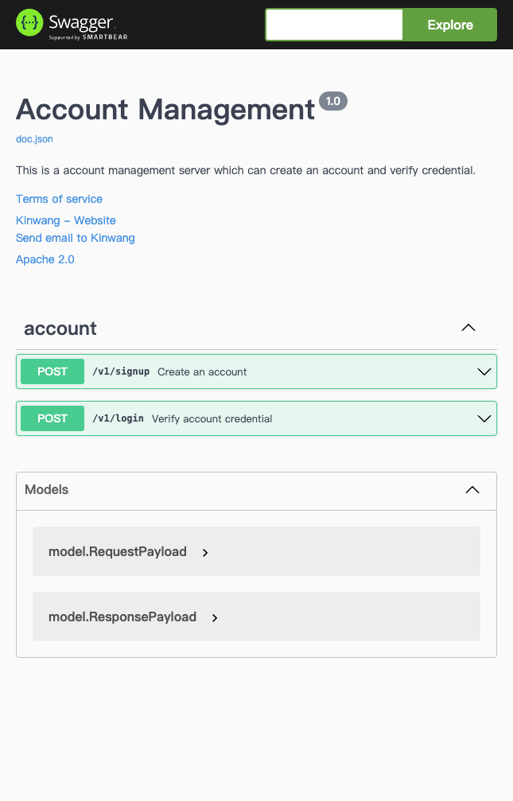
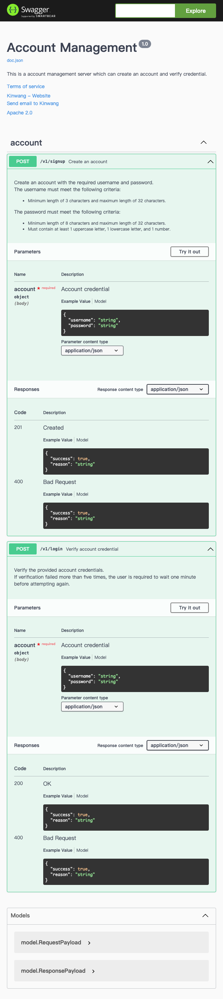
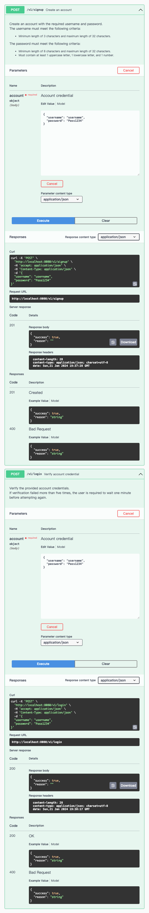

# Account Management

RESTful APIs for account management.

Two RESTful APIs have been implemented for creating accounts and verifying credentials. 

The project is packaged as a Docker image and published in Docker Hub.

## Structure

```text
.
├── api
│   ├── handler.go
│   ├── handler_test.go
│   └── routes.go
├── db
│   └── db.go
├── docs
│   ├── docs.go
│   ├── swagger.json
│   └── swagger.yaml
├── errors
│   └── errors.go
├── model
│   ├── account.go
│   └── payload.go
├── services
│   └── account.go
├── utils
│   ├── hash.go
│   └── validation.go
├── .env
├── go.mod
├── go.sum
├── main.go
├── Dockerfile
├── docker-compose.yml
└── README.md
```

## Overview

### API 1: Create Account

This API allows users to create an account with the required username and password.

- **Endpoint**: `/v1/signup`
- **HTTP Method**: `POST`

#### Input

```json
{
  "username": "string", // length: 3~32
  "password": "string"  // length: 8~32, with 1 lowercase letter, 1 uppercase letter and 1 number
}
```

#### Output

```json
{
  "success": true,      // boolean, true or false
  "reason": "string"    // reason for failure if applicable
}
```

### API 2: Verify Credential

This API allows users to verify the provided account credential is valid.

- **Endpoint**: `/v1/login`
- **HTTP Method**: `POST`


#### Input

```json
  "username": "string", // length: 3~32
  "password": "string"  // length: 8~32, with 1 lowercase letter, 1 uppercase letter and 1 number
```

#### Output

```json
{
  "success": true,      // boolean, true or false
  "reason": "string"    // reason for failure if applicable
}
```

## Quick Start

[Docker Hub Repository](https://hub.docker.com/r/kinwang94/acct-mgmt)

**Prerequisites**: Docker (Make sure you have the latest version installed. For more information about Docker and its installation, visit [Docker's official website](https://www.docker.com/)).

### Option 1: Docker Compose

1. Download Files

    ```bash
    curl -O https://raw.githubusercontent.com/kinwang94/acct-mgmt/main/docker-compose.yml
    curl -O https://raw.githubusercontent.com/kinwang94/acct-mgmt/main/.env
    ```

2. (Optional) Set Up Custom Environment Variables

    ```bash
    vi .env
    ```

3. Run the Containers

    ```bash
    docker-compose up
    ```

### Option 2: Pull Docker Images from Docker Hub and Deploy

1. Create a Docker Network
    
    ```bash
    docker network create <YOUR_NETWORK>
    ```

2. Pull and Run MongoDB Container

    ```bash
    docker pull mongo
    docker run --name mongo \
      --network <YOUR_NETWORK> \
      -e MONGO_INITDB_ROOT_USERNAME=<DB_USERNAME> \
      -e MONGO_INITDB_ROOT_PASSWORD=<DB_PASSWORD> \
      -v ./data:/data/db \
      -p 27017:27017 \
      -d mongo
    ```

3. Run the Application

    ```bash
    docker pull kinwang94/acct-mgmt
    docker run --network <YOUR_NETWORK> -e <YOUR_ENV_VARIABLE> kinwang94/acct-mgmt
    ```

### Option 3: Clone the Repository (Not Recommended)

1. Clone the Repository

    ```bash
    git clone git@github.com:kinwang94/acct-mgmt.git
    ```
    
2. Start MongoDB Service and Configure Custom MongoDB

3. Run the Project

    ```bash
    cd acct-mgmt
    go run ./main.go
    ```

## Interact with APIs

APIs are documented using Swagger. To interact with the APIs, launch the service and use the following link:

> http://localhost:8080/swagger/index.html

### APIs Interaction Example

Screenshots demonstrating the interaction with APIs via the Swagger interface are provided.

#### Overview





#### Interaction

